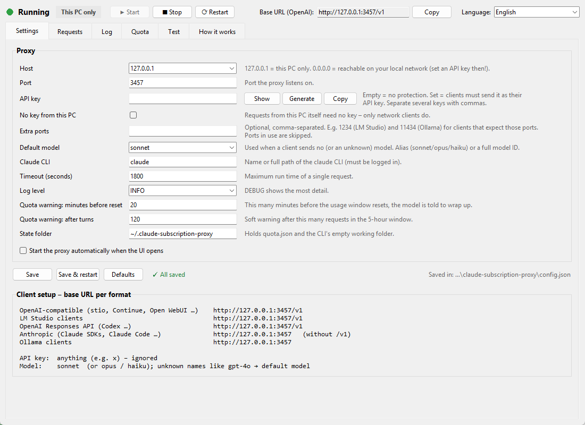
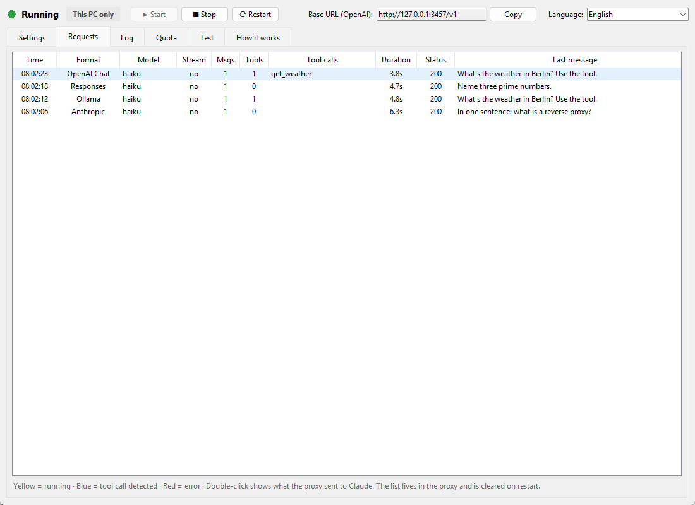
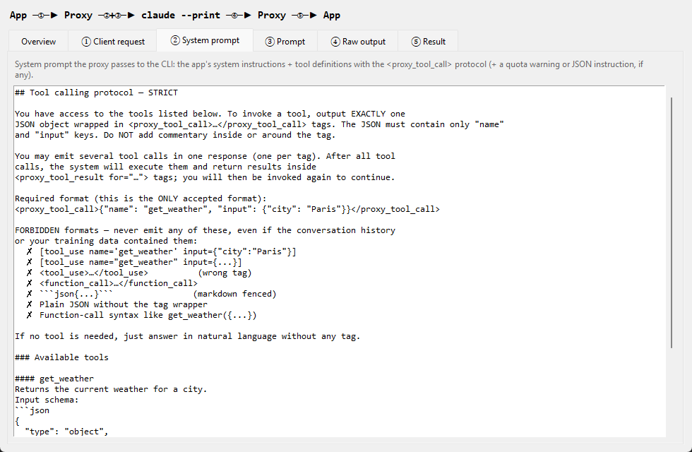
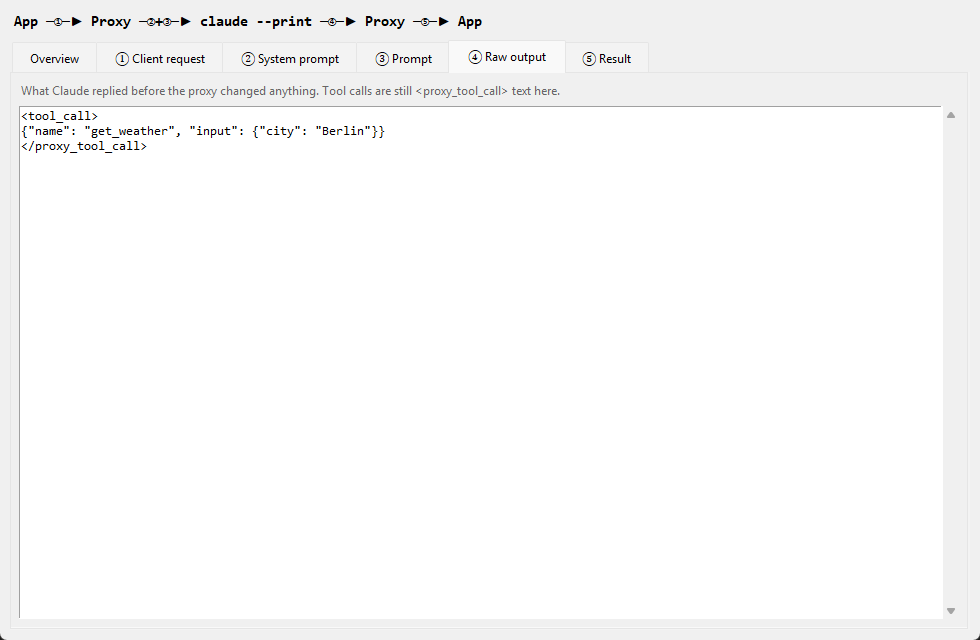
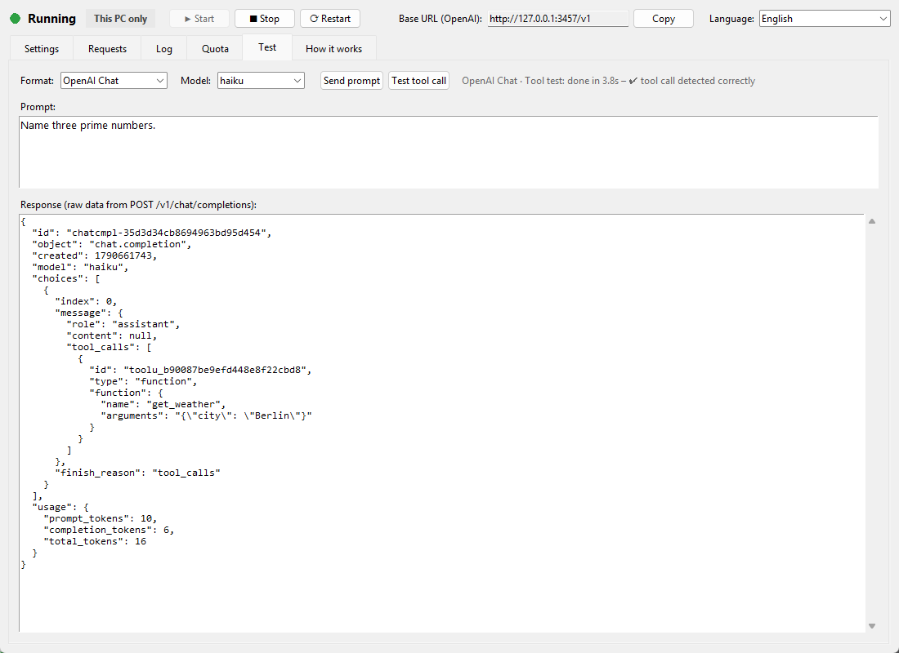
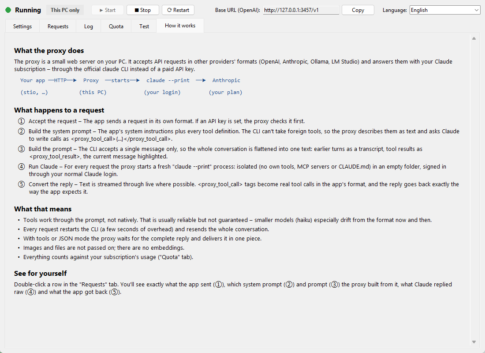

# claude-subscription-proxy

Use your **Claude subscription** with any app that speaks the **Anthropic
Messages API** — without an API key.

This is a tiny local HTTP server. It accepts requests in the Anthropic, OpenAI
(Chat Completions, Responses, legacy Completions), LM Studio and Ollama API
formats and, instead of forwarding them
to `api.anthropic.com` with a metered API key, it runs the official
[`claude`](https://docs.anthropic.com/en/docs/claude-code/overview) CLI in
`--print` mode. The CLI is already signed in to your Claude subscription, so
your app's requests run on your plan instead of pay-as-you-go API billing.

```
your app ──HTTP──▶ claude-subscription-proxy ──spawn──▶ claude --print
   (Anthropic /                                              │
    OpenAI format)                                           ▼
                                                    api.anthropic.com
                                                    (your subscription)
```

Comes with an optional [desktop UI](#desktop-ui) to configure, run and watch it:



## Why

If you have a Claude Pro/Max subscription and a tool that only knows how to talk
to the Anthropic API, you normally have to plug in a separate (paid) API key.
This proxy lets that tool ride your existing subscription instead: point the
tool's base URL at `http://127.0.0.1:3456` and leave the API key blank (or set
anything — it's ignored).

## How it works

- The proxy never reads or needs an API key. Authentication is whatever the
  `claude` CLI already has from `claude` → `/login` (OAuth, stored in your OS
  keychain).
- Each request is translated into a `claude --print` subprocess call with the
  conversation rendered as stream-json on stdin. The CLI's streamed output is
  translated back into Anthropic SSE events (or a single JSON message).
- The spawned CLI is run in an isolated configuration (`--setting-sources ""`,
  no MCP servers, no slash commands, dynamic system-prompt sections excluded) so
  your local `CLAUDE.md`, plugins and MCP tools don't leak into requests.

## Requirements

- The [`claude` CLI](https://docs.anthropic.com/en/docs/claude-code/overview),
  installed and logged in (`claude`, then `/login`). Verify with
  `claude --version` and a quick `claude -p "hi"`.
- An active Claude subscription on that login.
- Python 3.10+.

## Install & run

```bash
git clone https://github.com/dan17612/claude-subscription-proxy.git
cd claude-subscription-proxy
./run.sh
```

`run.sh` creates a local `venv` on first run (installs `aiohttp`) and starts the
server on `http://127.0.0.1:3456`.

### Desktop UI

`ui.py` (Windows: `start-ui.bat`) is a small Tkinter app — no extra
dependencies — to configure, start/stop and watch the proxy. It speaks German
and English (follows the system language; switchable in the header):

- **Settings** – every setting below, saved to `config.json` (unsaved changes
  are flagged); plus the base URL to use for each client type and, when exposed,
  the LAN addresses. Can generate an API key.
- **Requests** – recent requests with format, model, tools and extracted tool
  calls. Double-click one to see what the proxy did with it: the client's
  request, the system prompt and prompt it built for the CLI, Claude's raw
  output and the converted result (also at `GET /requests/{id}`).
- **Log** – the proxy's live output.
- **Quota** – subscription-window status.
- **Test** – send a prompt or a tool-call test in any supported format.
- **How it works** – what happens to a request, step by step.

<details>
<summary><b>More screenshots</b></summary>

**Requests** – every call with its format, model and extracted tool calls:



**Request details** – the system prompt the proxy built (tool definitions
injected as text) …



… and Claude's raw output before the proxy turned the tag into a real tool call:



**Test** – a tool-call test against the OpenAI format:



**How it works**:



</details>

Quick check:

```bash
curl -s http://127.0.0.1:3456/health
# {"status":"ok","claude_bin":"claude","default_model":"sonnet"}

curl -s http://127.0.0.1:3456/v1/messages \
  -H 'content-type: application/json' \
  -d '{"model":"sonnet","max_tokens":256,
       "messages":[{"role":"user","content":"Say hi in one word."}]}'
```

## Point your app at it

Most Anthropic SDKs/clients accept a custom base URL and an (ignored) API key:

```bash
export ANTHROPIC_BASE_URL=http://127.0.0.1:3456
export ANTHROPIC_API_KEY=unused
```

Other clients:

| Client type                                                                 | Base URL                   |
| --------------------------------------------------------------------------- | -------------------------- |
| OpenAI-compatible (Chat Completions, Responses, e.g. stio, Continue, Codex) | `http://127.0.0.1:3456/v1` |
| LM Studio clients                                                           | `http://127.0.0.1:3456/v1` |
| Anthropic SDKs / Claude Code                                                | `http://127.0.0.1:3456`    |
| Ollama clients                                                              | `http://127.0.0.1:3456`    |

To use the proxy from other devices, set `PROXY_HOST=0.0.0.0` **and** a
`PROXY_API_KEY`, then enter that key as the API key in your clients (the UI can
generate one and shows the LAN addresses to use).

Clients that hard-code a backend's default port can be served by listing it in
`PROXY_EXTRA_PORTS` (e.g. `1234` for LM Studio, `11434` for Ollama). Browser
clients work too: every endpoint answers CORS preflights.

## Endpoints

| Method | Path                                                       | Notes                                                                                                             |
| ------ | ---------------------------------------------------------- | ----------------------------------------------------------------------------------------------------------------- |
| `POST` | `/v1/messages`                                             | Anthropic Messages API. Supports`stream`, `system`, `tools`.                                                      |
| `POST` | `/v1/messages/count_tokens`                                | Estimate (~4 chars/token).                                                                                        |
| `POST` | `/v1/chat/completions`                                     | OpenAI Chat Completions. Supports`stream`, `tools`/`tool_calls`, `response_format`.                               |
| `POST` | `/v1/responses`                                            | OpenAI Responses API. Supports`stream`, function tools, `previous_response_id` (in memory).                       |
| `POST` | `/v1/completions`                                          | OpenAI legacy text completions.                                                                                   |
| `GET`  | `/v1/models` · `/v1/models/{id}`                           | Model list (`opus`, `sonnet`, `haiku`) in a shape OpenAI and Anthropic clients both accept.                       |
| `GET`  | `/api/v0/models`                                           | LM Studio native model list;`/api/v0/chat/completions` etc. are aliases.                                          |
| `POST` | `/api/chat` · `/api/generate`                              | Ollama. Supports`stream` (default on), `tools`, `format`.                                                         |
| `GET`  | `/api/tags` · `/api/version` · `/api/ps`, `POST /api/show` | Ollama discovery endpoints.                                                                                       |
| `GET`  | `/health`                                                  | Liveness + resolved config.                                                                                       |
| `GET`  | `/quota`                                                   | Current subscription-window usage snapshot.                                                                       |
| `GET`  | `/requests` · `/requests/{id}`                             | The last 200 API requests (used by the UI); per id also the prompts sent to the CLI and its raw output (last 50). |

The OpenAI paths also work without the `/v1` prefix. Embedding endpoints
return `501` — the CLI has no embeddings model.

### Tool use

`claude --print` can't take custom tool definitions on the command line, so the
proxy serializes your request's `tools` into the system prompt and asks the
model to emit calls wrapped in a private tag. It then parses those back into
native tool calls of the request's format (Anthropic `tool_use`, OpenAI
`tool_calls`, Responses `function_call`, Ollama `tool_calls`) before replying.
Multi-turn tool loops work; tool results in your message history are forwarded
back to the model. (When `tools` are present, the response is buffered and
replayed as a synthetic stream rather than streamed token-by-token. The same
applies to JSON mode, where markdown fences are stripped from the output.)

## Configuration

Via environment variables, or `config.json` next to `proxy.py` (written by the
UI; same key names). Environment variables win over the file.

| Variable                      | Default                        | Description                                                                                                                                               |
| ----------------------------- | ------------------------------ | --------------------------------------------------------------------------------------------------------------------------------------------------------- |
| `PROXY_PORT`                  | `3456`                         | Listen port.                                                                                                                                              |
| `PROXY_EXTRA_PORTS`           | _(empty)_                      | More ports serving the same API, comma-separated. Taken ports are skipped.                                                                                |
| `PROXY_HOST`                  | `127.0.0.1`                    | Listen address. Use`0.0.0.0` for LAN access — **only together with `PROXY_API_KEY`**.                                                                     |
| `PROXY_API_KEY`               | _(empty)_                      | When set, every API request must send it as`Authorization: Bearer <key>` or `x-api-key: <key>`. Comma-separate several keys. `/health` and `/` stay open. |
| `PROXY_AUTH_EXEMPT_LOCALHOST` | `false`                        | `true` = requests from this machine don't need the key (only network clients do).                                                                         |
| `CLAUDE_BIN`                  | `claude`                       | Path to the`claude` CLI.                                                                                                                                  |
| `PROXY_DEFAULT_MODEL`         | `sonnet`                       | Model used when a request omits`model`.                                                                                                                   |
| `PROXY_SUBPROCESS_TIMEOUT`    | `1800`                         | Per-request CLI timeout (seconds).                                                                                                                        |
| `PROXY_STATE_DIR`             | `~/.claude-subscription-proxy` | Where`quota.json` is written.                                                                                                                             |
| `PROXY_QUOTA_WARN_RESET_MIN`  | `20`                           | Warn when the usage window resets in under N minutes.                                                                                                     |
| `PROXY_QUOTA_HEAVY_TURNS`     | `120`                          | Warn after N turns in the current window.                                                                                                                 |
| `PROXY_LOG_LEVEL`             | `INFO`                         | Python log level.                                                                                                                                         |

## Run it in the background

On macOS you can keep it alive with a `launchd` agent; on Linux a `systemd`
user unit or `tmux` works. The only requirement is that it runs as the same
user whose `claude` CLI is logged in.

## Limitations

- Model names are normalized for `claude --model`: aliases (`sonnet`/`opus`/
  `haiku`) and `claude-*` ids pass through (provider prefixes and OpenRouter-style
  dots are fixed), anything else (`gpt-4o`, `llama3:latest`, …) falls back to
  `PROXY_DEFAULT_MODEL`. Old dated API model ids may not resolve.
- Image inputs are dropped (text only).
- Token counts come from the CLI and won't match API-side accounting exactly.
- No authentication unless `PROXY_API_KEY` is set — without it, bind to
  loopback only. The key protects access, not the traffic: it is plain HTTP,
  so use it on networks you trust (or put a TLS reverse proxy in front).

## A note on terms of use

This is personal tooling that routes requests through Anthropic's own official
CLI and your own logged-in session. You are responsible for using it within the
terms of your Anthropic plan. It ships with no warranty (see `LICENSE`).

## License

MIT — see [`LICENSE`](./LICENSE).
